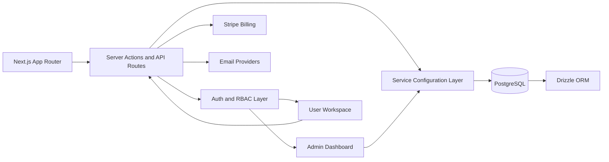
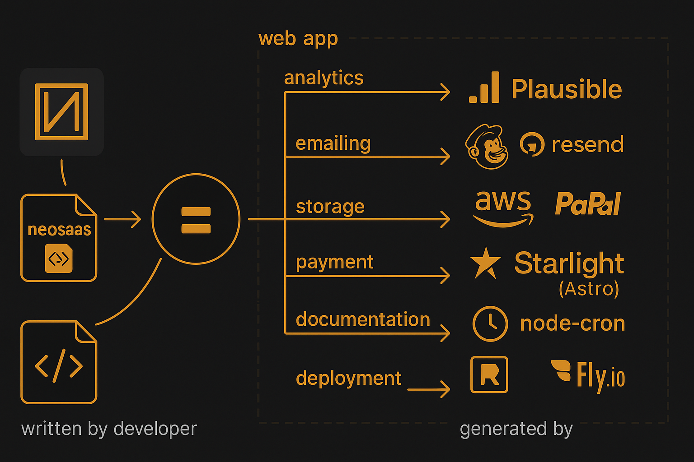

<!-- markdownlint-disable MD033 MD041 -->

<p align="center">
  
</p>

<h1 align="center">NeoSaaS Boilerplate</h1>

<p align="center">
  Build and launch a production-grade SaaS faster with a complete multi-tenant foundation.
</p>

<p align="center">
  
  
  
  
</p>

<p align="center">
  
</p>

## Why This Boilerplate

NeoSaaS helps you solve the biggest SaaS starter problems quickly:

- Functional foundation already built: authentication, roles, billing, admin, email.
- Clear architecture and modern stack: Next.js App Router, TypeScript, Drizzle, PostgreSQL.
- Fast setup and deployment: local development in minutes, production deployment on Vercel or Docker.
- Configurable services from admin UI: API credentials are database-driven instead of hardcoded.

## Product Walkthrough

<p align="center">
  <a href="https://www.youtube.com/watch?v=In0Rq15AqgM" target="_blank" rel="noopener noreferrer">
    
  </a>
</p>

<p align="center">
  Click the video preview to watch the full product walkthrough.
</p>

## Core Functional Modules

- Authentication: email/password + social OAuth, JWT sessions, secure cookies.
- Multi-tenant access control: user roles, permissions, company-based isolation.
- Billing and payments: Stripe integration, subscription flows, invoicing capabilities.
- Transactional email layer: provider abstraction (Resend, SES, TEM).
- Admin operating panel: API manager, service config, user/team management.
- Extensible page and feature architecture for vertical modules.

## Tech Stack

| Category | Technology |
| --- | --- |
| Framework | Next.js (App Router) + React |
| Language | TypeScript |
| Database | PostgreSQL |
| ORM | Drizzle ORM |
| Styling | Tailwind CSS + shadcn/ui |
| Auth | JWT + OAuth |
| Payments | Stripe |
| Email | Resend / AWS SES / Scaleway TEM |
| Runtime & Tooling | Node.js, pnpm |
| Deployment | Vercel or Docker |

## Architecture



<p align="center">
  
</p>

## Install in Minutes

### 1. Prerequisites

- Node.js 20+
- pnpm 10+
- PostgreSQL (local or cloud)

### 2. Setup

```bash
pnpm install
cp .env.example .env
```

Update `.env` with your own values from your secret manager.

### 3. Database and App

```bash
pnpm db:push
pnpm db:seed
pnpm dev
```

Open [http://localhost:3000](http://localhost:3000)

## Release and Versioning Bar

NeoSaaS uses a SemVer release model with automated GitHub workflow support.

| Stage | Rule | Output |
| --- | --- | --- |
| Patch | Bug fixes and safe internal changes | `vX.Y.Z` |
| Minor | New backward-compatible features | `vX.Y.0` |
| Major | Breaking changes | `vX.0.0` |

Release flow:

1. Choose bump type (`patch`, `minor`, `major`).
2. Update version in `package.json`.
3. Create git tag `vX.Y.Z`.
4. Publish GitHub Release with release notes.

Useful local commands:

```bash
pnpm version:patch
pnpm version:minor
pnpm version:major
pnpm release:auto
```

Release policy for this public edition:

- Every version tag must have a matching GitHub Release.
- Release notes must summarize functional changes, infrastructure changes, and migration notes.
- Public tags should only point to sanitized commits.

## Multi-Language Support

This public version is English-first and includes multilingual foundations:

- Locale-based routing through App Router segments (`app/[locale]`).
- Structure ready for translation dictionaries.
- Language policy documented for consistent UI text quality.

See: [docs/LANGUAGE.md](./docs/LANGUAGE.md)

## Documentation

- Product and project reference: [docs/PROJECT.md](./docs/PROJECT.md)
- Quick start guide: [docs/setup/QUICK_START.md](./docs/setup/QUICK_START.md)
- Vercel deployment: [docs/deployment/VERCEL.md](./docs/deployment/VERCEL.md)
- Status and changelog notes: [STATUS.md](./STATUS.md)

## Security for Public Repositories

- No hardcoded secrets in source code.
- Environment variables must come from your vault or secret manager.
- Never commit `.env` files.

## License

Private repository. Contact NeoSaaS maintainers for usage terms.
